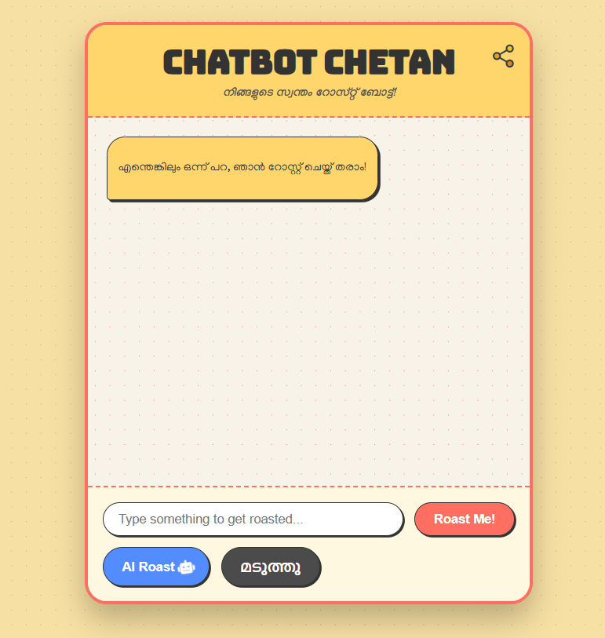
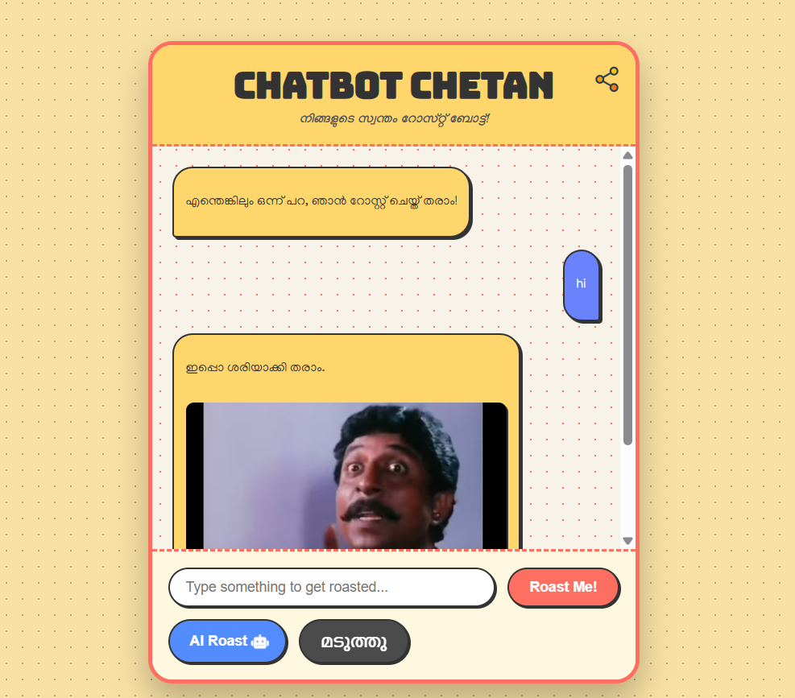

# [CHATBOT CHETAN] 🎯

## Basic Details
### Team Name: SnapChat

### Team Members
- Team Lead: Adithyan N - Gec Kozhikode
- Member 2: Muhammed Nidal - Gec Kozhikode

### Project Description
This is a Useless Project of Chatbot, it respond with Malayalam movie images and dialogues

### The Problem (that doesn't exist)
Getting Motivated by hearing PUNCH dialogues

### The Solution (that nobody asked for)
Using Gemini API, TTS, and basic Javascript functions

## Technical Details
### Technologies/Components Used
For Software:
- HTML/CSS/JS
- Vanilla JS
- Gemini API

### Implementation
For Software:Used PopOs and Win11
# Installation

1.git clone https://github.com/Irregular-luck/chatBot.git 
2.cd chatBot 
3.Run Index.html  

# Screenshots (Add at least 3)

HomePage of ChatBot

Classic Roast with Static pic and dialogues

AI replies to ur messages in a funny way

### Project Demo
**Try Chatbot Urself** ["Chatbot"](https://irregular-luck.github.io/chatBot/)

## Team Contributions
- [Adithyan N]: [Idea ,Styling]
- [Muhammed Nidal N]: [Javascript Logic,Api]

---
Made with ❤️ at TinkerHub Useless Projects 

